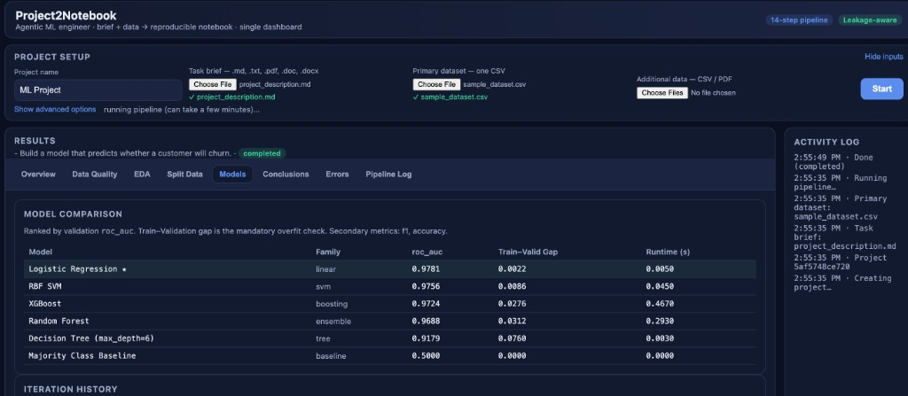

# Project2Notebook

**Project2Notebook** is an *agentic ML engineering system*. You give it a
**project brief** (a take-home assignment / project description), one or more
**CSV datasets**, and optionally some **reference PDFs**. It behaves like a
senior data scientist: it reads the brief, understands the business and ML
goals, inspects the data, runs **executable EDA**, builds **leakage-aware**
preprocessing and modeling pipelines, **iterates** to improve them, evaluates
once on a held-out test set, and produces a single **reproducible Jupyter
notebook**.

It is **not** a chatbot and **not** plain AutoML. It is a transparent,
tool-driven workflow where every step is an explicit agent node that calls tools
through an **MCP client**, and every tool call is logged and shown in the UI.



*Example run on the demo churn dataset: upload a brief and CSV, click **Start**, and browse results across tabs (Data Quality, EDA, models, conclusions) while the pipeline log streams on the right.*

---

## Contents
- [What it is / what it solves](#what-it-is)
- [Why it's different from a chatbot or AutoML](#why-different)
- [Why MCP](#why-mcp)
- [The Prior Art Agent](#prior-art-agent)
- [Agent workflow](#agent-workflow)
- [Iteration stopping rule](#stopping-rule)
- [How leakage is handled](#leakage)
- [Architecture](#architecture)
- [Run the backend](#run-backend)
- [Run the MCP servers](#run-mcp)
- [Run the frontend](#run-frontend)
- [Run the demo](#run-demo)
- [Limitations](#limitations)
- [Future work](#future-work)

---

<a name="what-it-is"></a>
## What it is / what problem it solves
Turning a data-science brief into a credible, reviewable analysis is repetitive
and error-prone: people re-implement the same EDA, forget leakage checks, mis-set
the validation split, or over-tune on the test set. Project2Notebook automates
the *engineering scaffolding* of a tabular ML project while keeping the reasoning
**explicit and auditable**, and emits a portfolio-quality notebook you can hand
to a reviewer.

<a name="why-different"></a>
## Why this is different from a generic chatbot or simple AutoML
- **vs. a chatbot:** it actually *executes* code (EDA plots, model training,
  metrics) through a controlled runner and tools, and produces artifacts and a
  notebook — not just prose.
- **vs. AutoML:** it doesn't just grid-search models. It interprets the brief,
  chooses a **split strategy** and **metric** from the problem, performs
  **leakage-aware** preprocessing, forms **hypotheses** for each improvement
  iteration, and *stops* using explicit rules. Every decision is visible.

<a name="why-mcp"></a>
## Why MCP is used instead of direct tools
> Direct tools show that an agent can call functions. MCP shows a more scalable
> architecture: tools are exposed by independent servers, discovered by a client,
> called through structured schemas, and logged in the UI. This separates
> reasoning from execution and makes the tool layer reusable across agents and
> applications.

In this repo the agents **never import tool implementations directly** — they go
through `backend/mcp_client/client.py`. Tools live in eight independent servers
under `mcp_servers/`. For the MVP the client talks to the servers **in-process**
(robust, dependency-light) while preserving the protocol-style architecture. The
same servers can be served over **real MCP stdio transport** (each server file
has a `serve_fastmcp` entrypoint); swapping the registry to a subprocess
transport requires no change to the agents. This limitation is documented in
`backend/mcp_client/registry.py`.

<a name="prior-art-agent"></a>
## What the Prior Art Agent does
The **Prior Art Agent** looks up how this *kind* of problem is usually solved:
common models, feature engineering, preprocessing, validation/split strategies,
metrics, and known leakage pitfalls. It reads any uploaded reference PDFs and
consults a curated, offline knowledge base keyed by task type.

> The Prior Art Agent is used for inspiration only. It may suggest common
> approaches from similar projects, but all suggestions must be verified against
> the actual project description and dataset.

**Web search defaults to ON** (`ENABLE_WEB_SEARCH=true`). However, no live
web-search *provider* is wired in this MVP, so the Prior Art Agent falls back to
its curated offline knowledge base and **says so explicitly** in
`prior_art.md` / the UI — it never pretends a real web search happened. Set
`ENABLE_WEB_SEARCH=false` to force the placeholder path.

<a name="agent-workflow"></a>
## Agent workflow
Deterministic graph (`backend/agents/graph.py`); the only loop is the controlled
iteration loop:

```
Project Understanding → Prior Art → Data Quality Review → Data Audit
→ EDA Planning → Executable EDA → EDA Review
→ Preprocessing Plan & Split → Baseline Modeling → First Conclusion
→ Iterative Improvement Loop (max 3) → Leakage Review
→ Final Test Evaluation → Notebook Author
```

Each node writes a clear artifact (`project_spec.json`, `data_quality_report.json`,
`data_audit_report.json`, `eda_report.md`, `eda_findings.json`,
`baseline_results.json`, `model_comparison.csv`, `first_conclusion.md`,
`iteration_*_report.json`, `iteration_summary.md`, `final_test_report.md`,
`final_notebook.ipynb`) under `backend/storage/artifacts/{project_id}/`.

### Agent memory + hybrid outputs + code-authoring
- **Artifact memory** (`backend/services/memory.py`): a single evolving
  `working_context.md` (+ `working_context.json`) is **read by every agent before
  acting and updated after each phase**. It records the project goal, task, target,
  metric, split, leakage risks, data-quality findings, selected/dropped features,
  preprocessing decisions, model results, best pipeline, **rejected ideas**,
  iteration history, and open questions — decision summaries only, **never hidden
  chain-of-thought**.
- **Hybrid outputs:** every phase writes a **human-readable Markdown report** *and*
  a **structured JSON** artifact, e.g. `project_understanding.md`+`project_spec.json`,
  `eda_report.md`+`eda_artifacts.json`, `preprocessing_decisions.md`+`preprocessing_plan.json`,
  `modeling_report.md`+`model_results.json`, `iteration_report.md`+`iteration_result.json`,
  `leakage_review.md`+`leakage_flags.json`.
- **Only code agents write/execute Python.** Planning/review agents (Project
  Understanding, Data Audit, EDA Planning, First Conclusion, Leakage Review, Final
  Evaluation) describe *what* code is needed. The **code agents**
  (`backend/agents/code_authoring.py`: EDA / Preprocessing / Modeling / Iteration /
  Notebook + a **Code Debugger Agent**) author code and run it through the
  **code-tools** MCP server with the loop:
  `plan → write code → validate-no-shell → run → inspect outputs/errors → summarize → update memory`.
- Generated code lives in `code/`, plots in `plots/`, tables in `tables/`,
  execution logs in `reports/`.

> Architectural note: the *canonical* preprocessing/modeling execution still runs
> through the tested preprocessing/modeling MCP tool servers; the Preprocessing and
> Modeling Code Agents additionally author + run standalone, validated, reproducible
> scripts (`code/preprocessing.py`, `code/modeling.py`) that power the notebook and
> act as sanity checks. EDA runs the full write→run→debug loop as its canonical path.

<a name="stopping-rule"></a>
## How the iteration stopping rule works
After baselines, the loop proposes a concrete, supported change each iteration,
trains it, and compares to the current best on **validation only** using
*relative improvement*:

```
higher-is-better:  relative_improvement = (new - best) / abs(best)
lower-is-better:   relative_improvement = (best - new) / abs(best)
```

A change is accepted only if it improves the primary validation metric by **more
than 5%** (configurable, `MIN_RELATIVE_IMPROVEMENT`) **and** does not create a
suspiciously large train–validation gap. The loop **stops** when any of these is
true:
1. it has completed **3 iterations**, or
2. relative improvement **≤ 5%**, or
3. **overfitting** is suspected (large train–valid gap), or
4. the next change is **not supported** by EDA / prior art / a clear hypothesis.

<a name="leakage"></a>
## How leakage is handled
- **Future/post-outcome columns are dropped** automatically (names matching
  `future/next/post_/_after/outcome` or columns the brief flags). In the demo,
  `num_sessions_next_7d` is dropped.
- **Preprocessing is fit on the training split only**, then applied to
  validation/test (`fit_preprocessor_on_train` → `transform_valid_test`).
- **Split strategy** is leakage-aware: time-based when there's a time component,
  grouped when the same entity repeats, stratified for classification otherwise.
- A dedicated **Leakage Reviewer** runs before the test set is touched.

> Project2Notebook does not use the test set during iterative improvement. The
> test set is evaluated only once after the final model is selected based on
> validation performance.

<a name="architecture"></a>
## Architecture
```
apps/web/            Next.js React UI (transparent timeline, tool calls, plots, notebook)
backend/
  main.py            FastAPI app
  api/               REST endpoints (projects, upload, run, notebook, chat)
  agents/            state.py, graph.py, code_authoring.py (code agents), nodes/*
  mcp_client/        client.py (call_tool + logging), registry.py
  services/          file_store, project_store, code_runner, notebook_builder,
                     artifact_store, memory (working_context), llm
  schemas/           Pydantic models
  storage/artifacts/{project_id}/  code/ plots/ tables/ reports/ + *.md + *.json + working_context.md
mcp_servers/         9 MCP tool servers (project understanding, prior art,
                     data inspection, eda, preprocessing, modeling, experiment,
                     notebook, code-tools)
demo/                synthetic churn dataset + brief
```

The **LLM provider is abstract** (`backend/services/llm.py`). With no
`OPENAI_API_KEY`, the system runs in **heuristic mode**: agents make
deterministic, data-derived decisions, so the whole pipeline runs offline and
reproducibly. With a key set, the LLM *enriches narrative* fields only. The UI
shows whether the LLM is enabled and never claims it did work it didn't.

---

<a name="run-backend"></a>
## How to run (single command)
Requires Python 3.9+. **No Node.js required** — the dashboard is a self-contained
page served directly by the backend.

```bash
# from the repo root
python -m venv .venv && source .venv/bin/activate   # optional
pip install -r requirements.txt
cp .env.example .env                                # optional; defaults work offline

python run.py
# Dashboard at http://localhost:8000  (opens automatically)
# API docs at http://localhost:8000/docs
```

The dashboard lets you, in one place: select a **task brief**, a **primary CSV**,
and **optional additional files**, click **Start**, and watch the results appear
across scrollable tabs — data cleaning decisions, EDA conclusions, chosen metrics
(primary + up to two secondary, plus the mandatory train–valid overfit check),
preprocessing & split, model comparison, the selected model, and conclusions.

See the [screenshot at the top](#project2notebook) for a full-page view of the UI.

Equivalent manual command (e.g. with autoreload during development):

```bash
uvicorn backend.main:app --reload --port 8000
```

<a name="run-mcp"></a>
## How to run the MCP servers
By default the backend uses the **in-process MCP client** — no separate process
is required, and all tool calls are still logged and shown in the UI. To inspect
the tool catalogue:

```bash
curl http://localhost:8000/api/tools
```

To run a server over **real MCP stdio transport** (optional; needs `pip install mcp`):

```bash
python -m mcp_servers.data_inspection_server     # or any *_server.py
```

Each server file exposes the same tools via `serve_fastmcp`. To make the client
use stdio transport instead of in-process, replace `InProcessRegistry` in
`backend/mcp_client/registry.py` (documented there). The agent-facing client API
(`list_available_tools`, `call_tool`) does not change.

<a name="run-frontend"></a>
## Optional: the richer Next.js frontend
The single-command dashboard above (served at `http://localhost:8000`) is the
recommended way to run everything. A separate, richer Next.js UI also exists and
is fully optional (requires Node.js 18+):

```bash
cd apps/web
npm install
cp .env.local.example .env.local         # NEXT_PUBLIC_API_BASE=http://localhost:8000
npm run dev
# UI at http://localhost:3000
```

Both UIs talk to the same backend API. Upload the brief + CSV (you can use the
files in `demo/`), then click **Start**. You'll see the agent timeline, every MCP
tool call, generated plots, the model comparison, the iteration history, the final
test report, and a download of the notebook.

<a name="run-demo"></a>
## How to run the demo
The fastest path (no frontend, runs the full pipeline and prints a summary):

```bash
python -m backend.cli demo
```

Or via the API/UI: create a project, upload `demo/project_description.md` and
`demo/sample_dataset.csv`, and run. The demo is a synthetic **churn** problem
that exercises binary classification, class imbalance, categorical + numeric
features, a time column, an intentional **leakage-prone future column**, missing
values, and model comparison.

You can also run with Docker:

```bash
docker compose up --build
```

---

<a name="limitations"></a>
## Current limitations
- **In-process MCP** by default (real stdio transport is available but not wired
  as the default).
- **Heuristic-first agents**: without an LLM key, reasoning is rule-based
  (intentionally, for reproducibility). LLM enrichment is optional.
- **Single train/valid/test split** (no cross-validation) and a **small,
  controlled hyperparameter search** within the 3-iteration budget.
- **Web search is not implemented** — prior art is curated/offline and clearly
  marked.
- Task coverage focuses on **binary/multiclass classification, regression, and
  anomaly detection**; forecasting/ranking/clustering are inferred but only
  partially modeled.
- The runner is a **controlled subprocess runner**, not a hardened sandbox.

<a name="future-work"></a>
## Future work
- Real MCP stdio/remote transport as the default client.
- Cross-validation, richer hyperparameter search, model calibration & threshold
  tuning to a business cost.
- Automatic temporal/aggregation feature engineering (lags, rolling windows) with
  re-audited leakage checks.
- A pluggable web-search provider for the Prior Art Agent.
- Background/streaming runs with live timeline updates.
- Subgroup modeling (e.g. per-platform models) when justified by EDA.

---

### A note on honesty
This project follows strict rules: no fake successful tool calls, stubs are
marked in code and UI, and the system never claims web search works when it is
disabled. The test set is held out until a single final evaluation, and all
preprocessing is fit on training data only.
